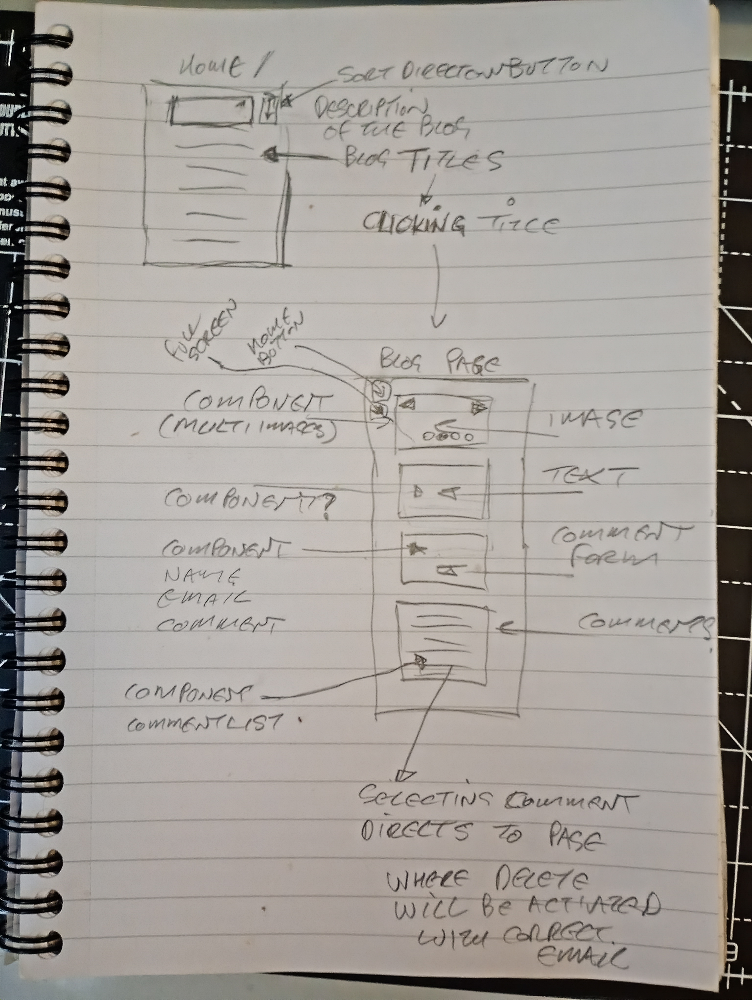

### A Personal Blog with comments feature

User Stories

🐿️ As a user, I want to view all posts with options to sort them in ascending or descending order so that I can easily find content based on my preferences.

🐿️ As a developer, I want to design a SQL schema that includes a posts table and a comments table, ensuring that comments are correctly associated with the corresponding post ID.

🐿️ As a user, I want to be able to delete posts using a delete button on each post’s page so that I can manage or remove my content from the database.

🐿️ As a user, I want to add comments on individual posts using a user-friendly form.

🐿️ As a user, I want to comment on posts directly on their dedicated pages so that my interactions are contextually tied to the content I view.

🐿️ As a user, I want to be automatically redirected to the posts page after creating a new post so I can immediately see my content in the context of all posts.

Requirements
🎯 Display all posts on the page, with an option to sort them in ascending or descending order.

🎯 Create a SQL schema for a posts table and a comments table, with the comments being connected to the posts table with a foreign key. Please submit your database schema, as is mentioned in the submission instructions.
🎯 Create a delete button on posts that allows users to delete the post from the database.

🎯 Create a form which saves comments to a dedicated comments table, with the comments being connected to the posts table with a foreign key.

🎯 Allow users to comment on individual posts in their dynamic routes. Comments should be associated with posts, and have a dynamic route (e.g. /posts/:postid).

🎯 Add a redirect when a user creates a post to redirect them to the posts page.

Reflection
Please also provide an assignment reflection in your project README.md file.

Required

🎯 What requirements did you achieve?

🎯 Were there any requirements or goals that you were unable to achieve?

🎯 If so, what was it that you found difficult about these tasks?

Optional
🏹 Feel free to add any other reflections you would like to share about your submission, for example:

Requesting feedback about a specific part of your submission.
What useful external sources helped you complete the assignment (e.g Youtube tutorials)?
What errors or bugs did you encounter while completing your assignment? How did you solve them?
What went really well and what could have gone better?

### Checkpoint 1

A basic blog, the home screen will hold a blog description and list of existing blogs, user will be able to sort them in ascending or descending order using a discrete button.

Clicking on an individual blog title in the list will open the blog page, Here the blog will be displayed, consisting of an image component at the top, this may later have a seriese of images that will be displayed in sequence, for now a singular image with no frills, bellow this will be a text content of the blog, below this will be a commment form, this being a component with fields for username email and comment along with a save button, below this is a component that will display any posted comments, giving the username and comment but not the email, if a comment is selected this will open a comment edit page where the user will be able to edit or delete the comment, they will need to enter the same email as used to make the comment, this gives a simple authentication simulation.

I will include a nav bar that will hold home and full screen icons, if time I will add other pages.
I will include a footer that will just show a copyright message.

After spending too long making my wireframes last week this week I opted for an archaic method and took a picture of it.

time for some coding ....

---
