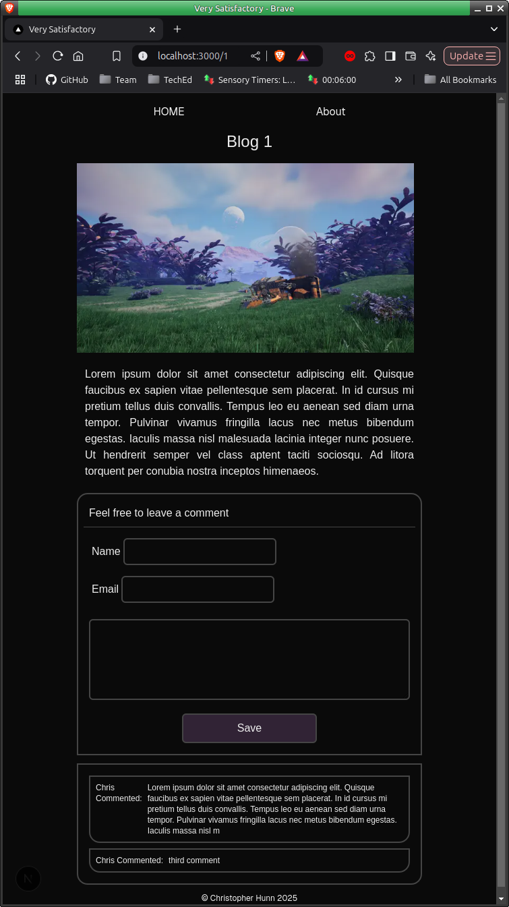
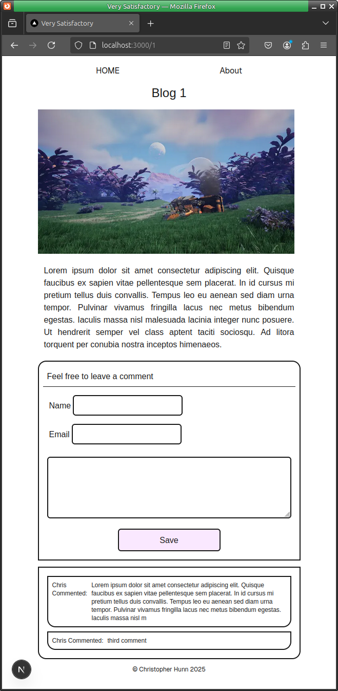

### A Personal Blog with comments feature

### Checkpoint 1

A basic blog, the home screen will hold a blog description and list of existing blogs, user will be able to sort them in ascending or descending order using a discrete button.

Clicking on an individual blog title in the list will open the blog page, Here the blog will be displayed, consisting of an image component at the top, this may later have a series of images that will be displayed in sequence, for now a singular image with no frills, bellow this will be a text content of the blog, below this will be a comment form, this being a component with fields for username email and comment along with a save button, below this is a component that will display any posted comments, giving the username and comment but not the email, if a comment is selected this will open a comment edit page where the user will be able to edit or delete the comment, they will need to enter the same email as used to make the comment, this gives a simple authentication simulation.

I will include a nav bar that will hold home and full screen icons, if time I will add other pages.
I will include a footer that will just show a copyright message.

After spending too long making my wireframes last week this week I opted for an archaic method and took a picture of it.

time for some coding ....

---

### Checkpoint 2

Again I am being haunted by last weeks assignment, I am not leaving the styling like I did back then, although I got my assignment functioning I got completely lost on the styling, So I have made a determined effort to have a presentable application this week, I have the home page 'finished' in so much as the styling is concerned, the only update here will be to the component holding the blog list, this will be a the title from each blog post and they will be links as outlined in the wireframe, I'm now going to design the tables and get the sql queries written.

---

### Checkpoint 3

At last some productive results, I spent a fair bit of time tackling an error on my table creation scripts, I wrote them out (find them in ./misc/makedatabase.sql) and eventually got them working, now looking at them a bit later I think the blogid should still be NOT NULL but I'll revisit this later, I now have a working blog without comments, the home page displays and introduction and links to the existing blogs, I have a header and footer that displays on all pages, clicking a Blog title will take you to the blog page and show you its content, one concern I have at the moment is that the home page has been created in app/page.js I suspect it would have been better to place it into its own component and kept that page a little more streamlined.

I seem to have forgotten how to handle non existent routes, I remember adding "/\*" to express, however for my \[blogid\] I check the passed in value is within range of the available rows as well as rejecting any other input, I do this by redirecting to a 404 page at app/error I have a feeling that theres a better way, but if not then I have at least demonstrated the use of redirect! although the requirement is for this to happen after a new comment has been added.

Its midday Friday so I may actually finish before the end of the day and get a weekend this week!

---

### Checkpoint 4

I'll keep my mouth shut next time, its late afternoon Saturday, and I've just managed to get the comments box working, I still have to display the comments but at least I now have them ending up in the database, I spent a lot of time trying to workout how to show an image using the image filename from the blog_content table - I've shelved this idea for now, I know I should be able to save the image in the database but I expect this would use too much space for a free account so was planning on using locale images on the server but I have no idea how to import them dynamically without having some ungodly import for all images that I 'may' need to render.

I need a break, next up is a component to render the comments

---

### Checkpoint 5

I have been working on the comment list rendering and the blog post display rendering order.

I have created the CommentList component to render any comments for any given blog and this is working as intended, The assignment requirements are causing a little confusion, it seems to assume I already have a working blog and that I need to add comments to individual blog posts, I say this because none of the requirements require a form to create a new blog post, we start with "Display all posts on the page .... " going with this I created some dummy placeholder blog posts in the blog_content table, this fulfills the first part of the second requirement 'Create a SQL schema for a posts table' I also created the comments table.

Third requirement "Create a delete button on posts that allows users to delete the post from the database." I miss understood this to be the comment posts we will be adding to the Blog Posts so planned for that, in all fairness I expect this will still demonstrate being able to delete posts - just not the actual blog_posts - I'm still going with this as its the less destructive path - if users delete my blog post theres no way at this time to add them in. Where as you, the assessor, can add and remove post comments forever, I hope this logic is not going to cause me to lose points.

So from here I will add a delete button for the comments - not the blog posts.

I have another issue thats taken up most of this morning, I have been tackling the sorting order for the list of blog posts on the home page, I am using a component to render the list of blog posts, and I can (in code) render them in reverse, I have added a button component that will be used to reverse the lists order (this is a client component), its functional only in that it changes its text when pressed. I have no idea right now how to link the two together, much searching on line has led me down too many rabbit holes, and I believe in completely the wrong direction.

I will now add the delete button and then get back onto Blog post order problem later.

---

### Checkpoint 6

I may not be the fastest but this is my first time!, I now have the delete function working, when you click on a comment you are taken to a form to enter the email address used when creating the email - this serves as a poor mans authentication until we learn about it for real next week, entering the correct email will result in the comment being delete, a wrong email will cause the delete query to fail, canceling the dialog will normal just cause the same query fail, however if there is a valid email entered it will still delete the comment - I could chase this but 'some' authentication is better than none at all.

Its getting late with less than six hours to the submission close time, I will now have another go at reversing the blog list order.

---

### Checkpoint 7

I have the Blog List displaying correctly, getting this working was not intuitive I still wonder if I've done this correctly, I am calling the home page from the home page, I bet this has some issues relating to performance.

To recap and check
User Stories

🐿️ As a user, I want to view all posts with options to sort them in ascending or descending order so that I can easily find content based on my preferences.

- Happy I have done this

🐿️ As a developer, I want to design a SQL schema that includes a posts table and a comments table, ensuring that comments are correctly associated with the corresponding post ID.

- I did not have any issues here - see /makedatabase.sql

🐿️ As a user, I want to be able to delete posts using a delete button on each post’s page so that I can manage or remove my content from the database.

- setting aside 'which' posts this has be implemented for the comments

🐿️ As a user, I want to add comments on individual posts using a user-friendly form.

- This was integrated onto the blog page using the NewComment component and is working.

🐿️ As a user, I want to comment on posts directly on their dedicated pages so that my interactions are contextually tied to the content I view.

- This is done

🐿️ As a user, I want to be automatically redirected to the posts page after creating a new post so I can immediately see my content in the context of all posts.

- this was not really applicable with the new comments being made on the same page as the blog, however clicking on a comment will allow you to delete it from another page, and this will redirect you back the the blog page when completed.

Requirements
🎯 Display all posts on the page, with an option to sort them in ascending or descending order.

- Done

🎯 Create a SQL schema for a posts table and a comments table, with the comments being connected to the posts table with a foreign key. Please submit your database schema, as is mentioned in the submission instructions.

- Done

🎯 Create a delete button on posts that allows users to delete the post from the database.

- the comment is the button, clicking on the comment will take you to a delete page, not sure if this will fail because its not a button even though the functionality has been met.

🎯 Create a form which saves comments to a dedicated comments table, with the comments being connected to the posts table with a foreign key.

- Done

🎯 Allow users to comment on individual posts in their dynamic routes. Comments should be associated with posts, and have a dynamic route (e.g. /posts/:postid).

- done? I have this working but I may have done this the wrong way.

🎯 Add a redirect when a user creates a post to redirect them to the posts page.

- this has been implemented on the comment deletion page, i have also used redirects to handle incorrect route on /[blogid/] page.js

Reflection

🎯 What requirements did you achieve? - listed above, I think I have met everything, just not a definitively as I would like, I suspect I have not have used best practice in some areas

🎯 Were there any requirements or goals that you were unable to achieve?

- I am not happy that I understand how I should have done many of the things today, even though I think I have got everything working, I'm not convinced that I've done it the correct way.

🎯 If so, what was it that you found difficult about these tasks?

- I suspect the basic concepts.

Optional
🏹 Feel free to add any other reflections you would like to share about your submission, for example:

- I think I have completed this through all of my notes above.

I am happier than I was last week, I still have not had my grade for it so may have made some of the same mistakes again this week.

I used Tailwind for the first time on this assignment, I was able to have a 'near presentable' style while I completed the coding this helped a lot, it will take more time and experience before I get excellent results.

I am a bit disappointed I did get to spend more time producing actual content, I may spend the remaining time fixing that theres only a couple of hours left.

One last thought, I have no clear idea how I would handle the images, I have a singular place holder image, but I wanted to use the image name from the database (imgsrc) to select the image held in public/images, theres no doubt a way to do this.

Later I hope to return and add a content form so I can create,edit and delete blog posts.
